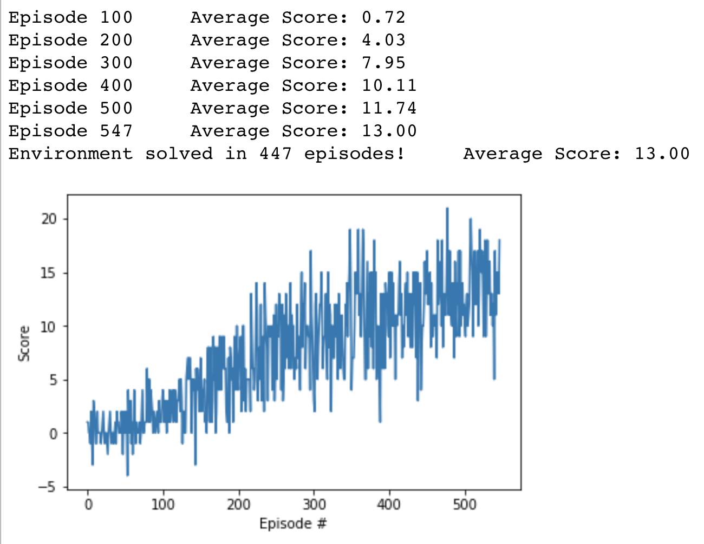

# Navigation Project

The goal of the agent is to collect as many yellow bananas as possible while avoiding blue bananas.  

## Learning Algorithm

I used a basic `DQN` with `experience replay` and `fixed Q target`.

`DQN` is a temporal-difference learning method based on Q Learning and leveraged by neural networks to build a non linear function able to approximate the action-value funtion q*.

```python
class Agent():
    """Interacts with and learns from the environment."""

    def __init__(self, state_size, action_size, seed):
        """Initialize an Agent object.
        
        Params
        ======
            state_size (int): dimension of each state
            action_size (int): dimension of each action
            seed (int): random seed
        """
        self.state_size = state_size
        self.action_size = action_size
        self.seed = random.seed(seed)

        # Q-Network
        self.qnetwork_local = QNetwork(state_size, action_size, seed).to(device)
        self.qnetwork_target = QNetwork(state_size, action_size, seed).to(device)
        ...

def act(self, state, eps=0.):
    """Returns actions for given state as per current policy.
    
    Params
    ======
        state (array_like): current state
        eps (float): epsilon, for epsilon-greedy action selection
    """
    state = torch.from_numpy(state).float().unsqueeze(0).to(device)
    self.qnetwork_local.eval()
    with torch.no_grad():
        action_values = self.qnetwork_local(state)
    self.qnetwork_local.train()
    ...
```

When the agent interacts with the environment, the sequence of experience tuples can be highly correlated. The naive Q-learning algorithm that learns from each of these experience tuples in sequential order runs the risk of getting swayed by the effects of this correlation. By instead keeping track of a replay buffer and using experience replay to sample from the buffer at random, we can prevent action values from oscillating or diverging catastrophically.

The replay buffer contains a collection of experience tuples (S, A, R, S'). The tuples are gradually added to the buffer as we are interacting with the environment.

The act of sampling a small batch of tuples from the replay buffer in order to learn is known as `experience replay`. In addition to breaking harmful correlations, experience replay allows us to learn more from individual tuples multiple times, recall rare occurrences, and in general make better use of our experience.

```python
def step(self, state, action, reward, next_state, done):
    # Save experience in replay memory
    self.memory.add(state, action, reward, next_state, done)
    
    # Learn every UPDATE_EVERY time steps.
    self.t_step = (self.t_step + 1) % UPDATE_EVERY
    if self.t_step == 0:
        # If enough samples are available in memory, get random subset and learn
        if len(self.memory) > BATCH_SIZE:
            experiences = self.memory.sample()
            self.learn(experiences, GAMMA)
```

In Q-Learning, we update a guess with a guess, and this can potentially lead to harmful correlations. To avoid this, we can update the parameters w in the network q^ to better approximate the action value corresponding to state S and action A with the following update rule:


where w− are the weights of a separate target network that are not changed during the learning step, and (SS, AA, RR, S') is an experience tuple.

```python
def learn(self, experiences, gamma):
    """Update value parameters using given batch of experience tuples.

    Params
    ======
        experiences (Tuple[torch.Variable]): tuple of (s, a, r, s', done) tuples 
        gamma (float): discount factor
    """
    states, actions, rewards, next_states, dones = experiences

    # Get max predicted Q values (for next states) from target model
    Q_targets_next = self.qnetwork_target(next_states).detach().max(1)[0].unsqueeze(1)
    # Compute Q targets for current states 
    Q_targets = rewards + (gamma * Q_targets_next * (1 - dones))

    # Get expected Q values from local model
    Q_expected = self.qnetwork_local(states).gather(1, actions)

    # Compute loss
    loss = F.mse_loss(Q_expected, Q_targets)
    # Minimize the loss
    self.optimizer.zero_grad()
    loss.backward()
    self.optimizer.step()

    # ------------------- update target network ------------------- #
    self.soft_update(self.qnetwork_local, self.qnetwork_target, TAU)  

def soft_update(self, local_model, target_model, tau):
    """Soft update model parameters.
    θ_target = τ*θ_local + (1 - τ)*θ_target

    Params
    ======
        local_model (PyTorch model): weights will be copied from
        target_model (PyTorch model): weights will be copied to
        tau (float): interpolation parameter 
    """
    for target_param, local_param in zip(target_model.parameters(), local_model.parameters()):
        target_param.data.copy_(tau*local_param.data + (1.0-tau)*target_param.data)
```


### Hyperparameter:
```python
BUFFER_SIZE = int(1e5)  # replay buffer size
BATCH_SIZE = 64         # minibatch size
GAMMA = 0.99            # discount factor
TAU = 1e-3              # for soft update of target parameters
LR = 5e-4               # learning rate 
UPDATE_EVERY = 4        # how often to update the network
```

### DQN NN architecture:
```python
Hidden Layer 1 = 64 units + relu activation
Hidden Layer 2 = 64 units + relu activation
Loss = MSE
```

## Plot of Rewards


The agent was able to receive an average reward (over 100 episodes) of at least +13 in 447 episodes.

## Ideas for Future Work

The performace can be improved with the following ideas.

DQN agent class
* Double DQN
* Priority experience replay
* Dueling DQN
* Rainbow techniques 
    * Multi-step bootstrap targets
    * Distributional DQN
    * Noisy DQN

